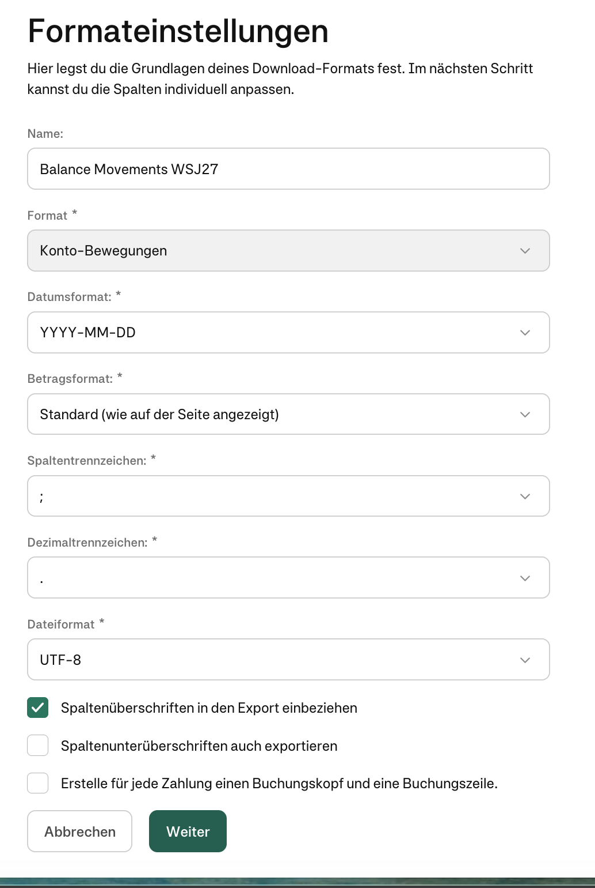

# Moss data model: export from Moss → import into Hitobito

How does financial data get from **Moss** (getmoss.com, our expense/wallet tool)
into this wagon's Hitobito bookkeeping? This document collects

1. the **general rules** (which extraction routes exist?),
2. the **Moss entities** (German + English name, help pages), and
3. per entity, **whether and how** its data can be extracted (API / CSV builder +
   SFTP / ad-hoc export), and where it is imported to in Hitobito.

> **Current state at WSJ (confirmed):** we currently use a **mix of the CSV
> builder and manual ad-hoc downloads**; the **public API** may be added later.
> The final route is not decided yet.

> **Important note on status:** only what is **backed by evidence** is
> documented; the source is linked in each case. Open points are marked
> **❓ open question**. Please do not read anything as settled that is not backed
> by a source here.
>
> Concrete export **sample files** live (once available) under
> [`doc/moss_export_examples/`](../moss_export_examples/) — that directory is
> excluded via `.gitignore` (it can contain real booking data and does **not**
> belong in the public repo).

## Sources

- Moss public API / data model: <https://developers.getmoss.com/>
  - Data-model overview: <https://developers.getmoss.com/data-model/>
  - Use cases / endpoint list: <https://developers.getmoss.com/use-cases/>
- CSV field reference (**German**):
  <https://help.getmoss.com/de/articles/11703042-csv-feldreferenz-und-tipps-zur-anpassung#h_e86ce8863d>
- CSV field reference (**English**):
  <https://help.getmoss.com/en/articles/11703042-csv-field-reference-and-customization-tips#h_e050825b85>
- Planned/automated SFTP delivery (product page):
  <https://www.getmoss.com/integrations/sap-csv>
- **Booking logic for Moss card payments → DATEV Unternehmen Online** (3-step chain):
  <https://help.getmoss.com/en/articles/7041394-booking-logic-moss-payments-datev-unternehmen-online>
- Wagon schema: [`db/schema.rb`](../../db/schema.rb) (table `moss_balance_movements`),
  migration [`db/migrate/20260411000100_add_moss_balance_movements.rb`](../../db/migrate/20260411000100_add_moss_balance_movements.rb),
  model [`app/models/moss_balance_movement.rb`](../../app/models/moss_balance_movement.rb)
- **Local OpenAPI spec** (authoritative for endpoints/fields):
  [`doc/moss_export_examples/openapi_spec/openapi.yaml`](../moss_export_examples/openapi_spec/openapi.yaml)
  (+ `schemas/…`).

---

## How to extract information from the Moss docs (without API calls)

> ⛔ **No Moss API calls.** For agents and scripts in this wagon: **never** call
> the Moss API — no `POST /oauth2/token`, no `/v1/...` requests, no live access
> to `public-api.getmoss.com`, not even read-only or for testing. API access uses
> **real production credentials** against real financial data. (The same rule is
> in [`AGENTS.md`](../../AGENTS.md).)

Permitted sources of information — in this order:

1. **Local OpenAPI spec** (`doc/moss_export_examples/openapi_spec/`): the
   **authoritative** source for endpoints, request/response schemas and field
   names. `openapi.yaml` holds the `paths:` block; schemas live under
   `schemas/<area>/<Name>.yaml` (e.g.
   `schemas/bank_transaction/BankTransaction.yaml`).
2. **Developer docs in the browser** — allowed **only** on the domain
   `https://developers.getmoss.com/` (do not leave it). Readable with
   **WebFetch**. Useful pages:
   - Overview/data model: `/`, `/data-model/`, `/use-cases/`
   - **Per-operation pages**: `/api/<operation-in-kebab-case>`, e.g.
     [`/api/search-bank-transactions`](https://developers.getmoss.com/api/search-bank-transactions).
     The `<operation>` = the `operationId` from the spec in kebab-case
     (`searchBankTransactions` → `search-bank-transactions`). These pages give a
     good overview but are partly **abridged** — when in doubt, consult the local
     spec.
3. **Help center** (`https://help.getmoss.com/`, DE/EN) for the CSV exports
   (field reference), see section 3.

---

## 1. General rules: the three extraction routes

There are (at least) three ways to get data out of Moss. For **every** entity it
has to be settled which of them are possible/used.

### A) Public API

REST API, versioned under `/v1`. **⛔ Do not call** (see "How to extract
information from the Moss docs" above) — documented here only for its structure.
Source: local OpenAPI spec + <https://developers.getmoss.com/>

- **Base URL:** `https://public-api.getmoss.com/v1`
- **Auth:** OAuth 2.0 *client credentials* (API key ID `kid_…` + secret `sk_…`
  → bearer token via `POST /oauth2/token`, token valid ~1 h). Only admins can
  create API keys.
- **Methods:** `GET` (read), `POST` (create), `PATCH` (partial update).
- **Rate limits:** 180 req/min reading, 20 req/min writing.
- **Time filters** for incremental fetching, e.g. for suppliers
  `create_date__gte`, `create_date__lte`, `update_time__gte`, `update_time__lte`;
  expenses are paginated via `page` / `page_size`.

Source: <https://developers.getmoss.com/use-cases/>

### B) CSV builder + automatic upload (Scheduled Data Transfer / SFTP)

Moss has a **CSV builder**: you assemble an export template from the available
fields (recommendation per the docs: start with the **"Generic CSV"** preset,
which contains all fields, then remove columns). Fields can be combined by
formula (`${fieldName1} and ${fieldName2}`); the debit/credit markers are called
**"Haben"/"Soll"** by default and can only be renamed through support.
Source:
[CSV field reference (DE)](https://help.getmoss.com/de/articles/11703042-csv-feldreferenz-und-tipps-zur-anpassung),
[CSV field reference (EN)](https://help.getmoss.com/en/articles/11703042-csv-field-reference-and-customization-tips).

These templates can be delivered to a target server **automatically via
Scheduled Data Transfer (SFTP)** (frequency configurable; records selectable).
Source: <https://www.getmoss.com/integrations/sap-csv>.

> **State at WSJ:** the CSV builder is in use; whether delivery runs automatically
> over **SFTP** or the templates are downloaded manually is not finally decided
> (currently mixed operation with route C).

### C) Ad-hoc export from the Moss UI

Manual download of a CSV/file straight from the Moss UI (no CSV-builder template,
no SFTP). **This route exists and we use it** (confirmed). The ad-hoc export
additionally lets you pick a **format** (standard CSV in the respective UI
language, or a DATEV package).

**Naming convention of the sample files** (under
[`doc/moss_export_examples/`](../moss_export_examples/)): prefix = entity, suffix =
the chosen export option. Example for the entity *balance movements*:

| File name (pattern) | Export option |
| --- | --- |
| `balance-movements_<date>_EN.csv` | standard ad-hoc CSV, **English** UI/columns |
| `balance-movements_<date>_DE.csv` | standard ad-hoc CSV, **German** UI/columns |
| `balance-movements_<date>_custom_csv_builder.csv` | **custom CSV** from the CSV builder (route B) |
| `balance-movements_<date>_DATEV.zip` | **DATEV package** (DATEV XML, see below) |

For **card transactions** (prefix `transactions_`) there are additional
formats/attachments (see 5.2.1):

| File name (pattern) | Export option |
| --- | --- |
| `transactions_<date>_EN.csv` / `_DE.csv` | standard ad-hoc CSV (EN/DE) |
| `transactions_<date>_WSJ27.csv` | **custom CSV (CSV builder)**, WSJ format (94 columns, superset; see 5.2.7) |
| `transactions_<date>_DATEV.csv` | ad-hoc **DATEV CSV** (EXTF Buchungsstapel, without the EXTF header line) |
| `transactions_<date>_Addison.csv` | ad-hoc **Addison/DATEV** (EXTF Buchungsstapel **with** the EXTF header line) |
| `transactions_<date>_attachments.zip` / `_attachments/` | **combined receipt PDF** per transaction (`<Transaction-ID>.pdf`) |
| `transactions_<date>_receipts.zip` / `_receipts/` | **individual receipts** (referenced in `Invoice File Name`) |

> **Samples needed for the remaining entities:** for every further entity that can
> be extracted by export (transactions, invoices, reimbursements) please put one
> sample per format into `doc/moss_export_examples/`. Once samples exist, the
> respective format is documented here.
> ❓ For **which further entities** is there an ad-hoc or DATEV export?

---

## 2. Moss entities (data model)

The API data model names **13 core entities**.
Source: <https://developers.getmoss.com/data-model/>. (German names are added
where the CSV field reference documents them; otherwise marked "—".)

| Entity (EN) | Entity (DE) | Short description (source: data-model) |
| --- | --- | --- |
| **Bank Account** | Moss-Wallet / Bankkonto | Moss wallet held by the organisation; status `ACTIVE`/`CLOSED`, funding `CREDIT`/`DEBIT`. |
| **Bank Transaction** | Kontobewegung¹ | Money movement on a Moss account: `CARD`, `PAYOUT`, `WITHDRAWAL`, `TOP_UP`, `REPAYMENT`. |
| **Expense** | Ausgabe | An expense item (card transaction, invoice or reimbursement) including booking attributes; splittable into line items. |
| **Expense Account** | Sachkonto | Ledger account / chart-of-accounts entry an expense is booked to (e.g. travel, software). |
| **Dimension** | Dimension | Tagging axis for multi-dimensional accounting; fixed: **cost center** + **cost carrier**, plus custom ones. |
| **Dimension Item** | Dimensionswert | A single value inside a dimension (e.g. "Project A"). |
| **Department** | Abteilung | Higher-level org unit made up of several teams. |
| **Team** | Team | Org unit within the organisation (grouping, approval workflows). |
| **User** | Nutzer\*in | Person with a Moss account. |
| **Organisation** | Organisation | Legal entity / company account in Moss (top-level scope). |
| **Supplier** | Lieferant / Kreditor | Creditor that payments/invoices go to. |
| **Tax Rate** | Steuersatz | VAT/tax treatment (percentage, code, country). |
| **Payment Term** | Zahlungsbedingung | Agreed due-date terms of an invoice. |
| **File** | Datei / Beleg | Document attached to an expense. |

¹ "Kontobewegung" is derived from the CSV export name (section 3, balance
movements); the API entity is called **Bank Transaction**
(`POST /v1/bank-transactions/search-query`). API *Bank Transaction* and CSV
*Balance Movement* are **not** the same data set: `BankTransaction` is lean
(amount/date/type/fees), while the accounting fields of the CSV come from
`Expense`. Details in **5.1.4**.

### Expense types & status (source: data-model)

- **Expense types:** card transaction (`EXPENSE`/`REFUND`/`CASHBACK`),
  invoice (`EXPENSE`/`CREDIT_NOTE`), reimbursement (`EXPENSE`).
- **Lifecycle status:** `DRAFT`, `SUBMITTED`, `REVIEWED`, `APPROVED`, `REJECTED`,
  `FLAGGED`, `APPROVAL_SKIPPED`, `VERIFIED`, `VERIFICATION_SKIPPED`, `COMPLETED`,
  `DELETED`, `INHERITED`, `UNKNOWN_DEFAULT_OPEN_API`.
- **Line-item subtypes:** `MAIN` (standard) / `CORRECTION` (negative correction).
- All resources: ISO-8601 timestamps `createTime`/`updateTime`/`deleteTime`,
  scoped by `organisationId`.

### API endpoints (complete)

Source: **local OpenAPI spec**, `paths:` block
(`doc/moss_export_examples/openapi_spec/openapi.yaml`). **⛔ Reference only — do
not call.** The `operationId` doubles as the kebab-case slug of the developer-doc
page `/api/<operation>`.

| Method & path | operationId | Purpose |
| --- | --- | --- |
| `GET /v1/expenses` | `getExpenses` | Expenses (card transactions, invoices, reimbursements) including booking attributes. |
| `GET /v1/expense-accounts` · `/{id}` | `getAllExpenseAccounts` · `getExpenseAccountById` | Ledger accounts (chart of accounts). |
| `GET /v1/dimensions` · `POST` · `GET/PATCH /{id}` | `getAllDimensions` · `createDimension` · `getDimensionById` · `updateDimension` | Dimensions (cost centers/carriers, custom). |
| `GET /v1/dimensions/{id}/items` · `POST` · `GET/PATCH /{itemId}` | `getAllDimensionItems` · `createDimensionItem` · `getDimensionItemById` · `updateDimensionItem` | Dimension values. |
| `GET /v1/suppliers` · `POST` · `GET/PATCH /{id}` | `getAllSuppliers` · `createSupplier` · `getSupplierById` · `updateSupplier` | Creditor master data. |
| `GET /v1/payment-terms` · `/{id}` | `getAllPaymentTerms` · `getPaymentTermById` | Payment terms. |
| `GET /v1/tax-rates` · `/{id}` | `getAllTaxRates` · `getTaxRateById` | Tax/VAT rates. |
| `GET /v1/users` · `/{id}` | `getAllUsers` · `getUserById` | Users. |
| `GET /v1/teams` · `/{id}` | `getAllTeams` · `getTeamById` | Teams. |
| `GET /v1/departments` · `/{id}` | `getAllDepartments` · `getDepartmentById` | Departments. |
| `GET /v1/bank-accounts` | `getAllBankAccounts` | Moss wallets/bank accounts. |
| `GET /v1/bank-accounts/{id}/balance` | `getBankAccountBalance` | Balance of a wallet. |
| `POST /v1/bank-transactions/search-query` | `searchBankTransactions` | **Balance movements** (money movements on Moss wallets); filters include `bookingDateFrom/To`, `accountIds`. |
| `POST /v1/files/search-query` | `searchFiles` | Search files/receipts belonging to expenses. |
| `GET /v1/files/{fileId}/content` | `downloadFile` | Download receipt/file content (PDF, image). |

The spec contains further schema areas without a public path in this `paths:`
block (among them `accounting_event`, `reconciliation_*`,
`general_ledger_account`, `accounting_period`, `document`) — currently not
relevant for our export/import, but present under `schemas/`.

---

## 3. CSV export types (CSV builder)

### 3.1 Supported format options (as of August 2026)

In the CSV builder you pick the entity to export under **"Format"** when creating
a format. **As of August 2026** the following formats are available, among others
(source: user report / CSV-builder UI format dropdown; the screenshot in 3.2 only
shows the selected value "Konto-Bewegungen"):

| Format (DE, UI) | Entity (EN) | Documented in the field reference? | Note |
| --- | --- | --- | --- |
| **Transaktion** | **Transaction** (card transaction) | yes (field groups below) | |
| **Rückerstattung** | **Reimbursement** | yes | |
| **Rechnung** | **Invoice** | yes | |
| **Konto-Bewegung** | **Balance Movement** | yes (complete: section 5.1) | used by us → `moss_balance_movements` |
| **Einkauf** | **Purchase** | no — **not** in the help docs, but exists per the UI | not (yet) used at WSJ |
| **Haushalt** | **Budget** | no — **not** in the help docs, but exists per the UI | not (yet) used at WSJ |
| *(Aktive Rechnungsabgrenzung)* | **Prepayment** / accrual | yes | present in the dropdown, **not relevant for WSJ** |

> Notes: **Prepayment** exists in the UI dropdown (listed above only for
> completeness — irrelevant for WSJ). **Einkauf (Purchase)** and **Haushalt
> (Budget)** really do exist in the CSV builder, but are **not** documented in the
> public [CSV field reference](https://help.getmoss.com/de/articles/11703042-csv-feldreferenz-und-tipps-zur-anpassung)
> — field lists for them can therefore only be obtained from a real export (put a
> sample into `doc/moss_export_examples/` should it ever be needed).

**Field groups per the field reference** (for the types documented there):

| Export type (DE) | Export type (EN) | Field groups (excerpt, source: field reference) |
| --- | --- | --- |
| **Transaktionen** (card transactions) | **Card Transaction Exports** | transaction basics · dates & periods · amounts & currency · merchant & supplier · accounting & categorisation · employee & internal · links & attachments · air travel & breakdown |
| **Rechnungen** | **Invoice Exports** | invoice basics · amounts & currency · dates · accounting & categorisation · employees & teams · supplier & payment details · cost centers & projects · references/linking · early-payment discount |
| **Rückerstattungen** | **Reimbursement Exports** | basics · dates & periods · amounts & currencies · accounting & categorisation · people & teams · supplier & travel details |
| **Kontobewegungen** | **Balance Movements Exports** | transaction details · dates & periods · amounts & currencies · accounting & categorisation · linked documents & references · supplier & internal team data |
| **Aktive Rechnungsabgrenzungsposten** | **Prepayment Exports** (accrual entries) | accrual basics · amounts & currency · accounting & categorisation · invoice & date · notes |

Source:
[CSV field reference (DE)](https://help.getmoss.com/de/articles/11703042-csv-feldreferenz-und-tipps-zur-anpassung#h_e86ce8863d),
[CSV field reference (EN)](https://help.getmoss.com/en/articles/11703042-csv-field-reference-and-customization-tips#h_e050825b85).

> The **complete** field lists per group are in the linked field reference and are
> not copied here. Once we have a concrete export template/sample file, its actual
> column set is documented in **section 5** (field reference per entity). Complete
> so far: **balance movements** (5.1) and **card transactions** (5.2).

### 3.2 Format settings for WSJ custom formats (reference)

**Rule:** new custom CSV-builder formats for WSJ are created with the **same
format settings** as the reference format **"Balance Movements WSJ27"** (only the
entity under "Format" and the column selection change).

Settings per the screenshot (as of August 2026):

| Setting | Value for "Balance Movements WSJ27" |
| --- | --- |
| **Name** | `Balance Movements WSJ27` (adjust per entity) |
| **Format** | `Konto-Bewegungen` (= the entity to export; see 3.1) |
| **Date format** | `YYYY-MM-DD` |
| **Amount format** | `Standard (as displayed on the page)` |
| **Column separator** | `;` (semicolon) |
| **Decimal separator** | `.` (period) |
| **File format** | `UTF-8` |
| **Include column headers in the export** | ✅ on |
| **Also export column sub-headers** | ☐ off |
| **Create a booking header and a booking line for each payment** | ☐ off |

> This combination produces exactly the format of the file
> `balance-movements_…_custom_csv_builder.csv` (separator `;`, decimal point,
> UTF-8, ISO date, header row with column names) that fills
> `moss_balance_movements`. The import scripts/parsers expect these settings — do
> **not** deviate for new formats (especially `;`, decimal `.`, UTF-8, ISO date).

---

## 4. Import into Hitobito

### 4.1 Current state: `moss_balance_movements`

Until recently the wagon had **exactly one** Moss table:
`moss_balance_movements` (model `MossBalanceMovement`, migration
`20260411000100`). It hangs off a dedicated `WsjrdpFinAccount` "Moss Wallet"
(`fin_accounts.transaction_type = 'MossBalanceMovement'`, created in the same
migration) and is reconciled with `AccountingEntry`s through the
`WsjrdpTransaction` concern (`accounting_entries.moss_balance_movement_id`).

Its columns clearly mirror the CSV export **Kontobewegungen / balance movements**
(section 3). Comments in the migration map some columns to DATEV terms:

| Column (excerpt) | Meaning / mapping |
| --- | --- |
| `moss_transaction_id`, `sub_row_number` | Moss transaction ID + row number (unique index together). |
| `unique_item_number` | Business-level uniqueness key of the row (unique). |
| `transaction_state`, `transaction_type` | State/type of the movement. |
| `payment_date`, `booking_date` | Payment/booking date. |
| `amount`, `currency`, `amount_excl_vat` | Amount (converted to cents in the model via `amount_cents`), currency, net. |
| `original_amount*`, `original_currency`, `conversion_rate*` | Foreign currency + conversion rate (including the fee variant). |
| `fees_amount`, `payment_fee`, `transaction_amount_excluding_fees` | Fees. |
| `supplier_account` / `supplier_name` | Creditor number / creditor name. |
| `account_number` / `name_of_expense_account` | Ledger account number / name. |
| `category`, `moss_balance_account`, `cash_in_transit_account` | Category, Moss clearing accounts. |
| `reason_for_purchase`, `note`, `payment_reference` | Purpose/note/payment reference. |
| `recipient_account_number`, `recipient_bank_code` | Recipient account details. |
| `invoice_number`, `team_name`, `cardholder`, `client_number` | References/assignment. |
| `moss_expense_id`, `moss_invoice_id`, `moss_reimbursement_id` | Link to the underlying expense/invoice/reimbursement. |
| `moss_attachment_url` | Receipt link. |
| `first_export_date` | Export timestamp. |

Source **confirmed:** `moss_balance_movements` is filled from the CSV export
**Kontobewegungen / balance movements** (not through the API), specifically from
the **custom CSV of the CSV builder** (route B). Evidence: the 41 columns of the
sample file `balance-movements_…_custom_csv_builder.csv` map **1:1** onto the
table columns (including the fields `record_type`, `csv_line_type`, `period`
commented out in the migration). The complete column ↔ field mapping is in
**section 5** (field reference for balance movements).

### 4.2 Further tables

Newly added: **`moss_card_transactions`** + **`moss_card_transaction_bookings`**
(card transactions, migration `20260829000200`, applied) — details/field
reference in **5.2**. There is deliberately **no** backlink from
`accounting_entries`; the link to DATEV lives on the Moss side (5.2.6). Further
`moss_*` tables (invoices/reimbursements) will follow as needed.
(Related master-data tables such as creditors/cost centers/ledger accounts are
the subject of [`doc/fin/bookkeeping_schema_review.md`](bookkeeping_schema_review.md);
their relationship to the Moss entities **Supplier / Dimension / Expense Account**
is still to be clarified.)

---

## 5. Field reference per entity

One table per entity. Columns:

1. **API field** — field name of the public API (data model/endpoint).
2. **Wagon column** — column of the corresponding `moss_*` table.
3. **CSV builder (EN)** — field name in the CSV builder / English field reference.
4. **CSV builder (DE)** — field name in the CSV builder / German field reference.
5. **Ad hoc (EN / DE)** — column name in the standard ad-hoc export (EN and DE
   language variants), `—` if not present there.
6. **Explanation / example** — brief meaning; examples are **synthetic** (no real
   booking data).

> **On the API-field column:** the API does **not** expose the rich accounting
> fields of the balance-movements CSV in *one* resource. The API entity for a
> money movement is **`BankTransaction`**
> (`POST /v1/bank-transactions/search-query`) with only a few fields;
> creditor/ledger account/category/VAT/links hang off the **`Expense`** resource
> (`GET /v1/expenses`). The CSV export is therefore a **consolidated/joined**
> export, not a 1:1 mirror of an API resource. Column 1 hence lists only the
> `BankTransaction` fields that can be mapped **with certainty** (source: local
> spec `schemas/bank_transaction/BankTransaction.yaml`); "≈" = plausible, but not
> documented 1:1. Details in **5.1.4**.

Sources of the field names:
[CSV field reference DE](https://help.getmoss.com/de/articles/11703042-csv-feldreferenz-und-tipps-zur-anpassung#h_e86ce8863d) ·
[EN](https://help.getmoss.com/en/articles/11703042-csv-field-reference-and-customization-tips#h_e050825b85)
plus the sample files `balance-movements_…_{custom_csv_builder,EN,DE}.csv`.

### 5.1 Kontobewegungen / balance movements

Feeds the table **`moss_balance_movements`** from the **custom CSV (CSV builder)**.
The custom-builder export (41 columns) matches the table 1:1; the standard ad-hoc
export (33 columns, EN/DE) has a **partly different** field set (among others VAT
and cost-center fields the table does not carry — see 5.1.2).

#### 5.1.1 Fields from the CSV-builder catalogue (order per the field reference)

| API | Wagon column | CSV builder (EN) | CSV builder (DE) | Ad hoc (EN / DE) | Explanation / example |
| --- | --- | --- | --- | --- | --- |
| — | — | Transaction Ordinal | Transaktions-Ordnungszahl | — | Sequential tx number; builder catalogue only, unused in our templates. |
| — | — | Row Number | Zeilennummer | — | Row number of the movement; unused. |
| — | `sub_row_number` | Sub-row Number | Unterzeilennummer | — | Split position within a tx; part of the unique index (with `moss_transaction_id`). E.g. `0`. |
| — | `moss_transaction_id` | Transaction ID | Transaktions-ID | Transaction ID / Transaktions-ID | Moss transaction ID. |
| — | `transaction_state` | Transaction State | Transaktionsstatus | Transaction State / Transaktionsstatus | State of the movement. |
| `transactionType` | `transaction_type` | Transaction Type | Transaktionstyp | — | Type of the movement. |
| — | `record_type` *(commented out)* | Record Type | Datensatz-Typ | — | Record type; the table column is commented out in the migration. |
| `valueDate` ≈ | `payment_date` | Payment Date | Zahlungsdatum | Payment Date / Zahlungsdatum | Payment date. E.g. `2026-08-23`. Empty where the export profile carries no payout day of its own (reimbursements, invoices); on a card payment it precedes the booking day by one to six days. The Moss transactions list offers it as the optional Zahlungsdatum column. |
| `bookingDate` | `booking_date` | Booking Date | Buchungsdatum | Booking Date / Buchungsdatum | Booking date — the day the movement was booked in the Moss wallet, and THE date the views show, sort and aggregate by. Model: `value_date = booking_date`. |
| — | `first_export_date` | First Export Date | Erstes Exportdatum | First Export Date / Erster Export Datum | First export of this row. |
| — | — | Month end date | Ende des Monats | — | End of month; unused. |
| — | `period` *(commented out)* | Period | Zeitraum | — | Period; column commented out. |
| — | — | Period YYYY/MM | Zeitraum JJJJ/MM | — | Period as `YYYY/MM`; unused. |
| `amount.amount` | `amount` | Amount | Betrag | Amount / Betrag | Amount (API: `Money{amount,currency}`, fees included); in the model → `amount_cents` (×100). |
| — | — | Amount Negated | Negierter Betrag | — | Sign-inverted; unused. |
| — | — | Amount Debit | Soll-Betrag | — | Debit amount; unused. |
| — | — | Amount Credit | Haben-Betrag | — | Credit amount; unused. |
| — | `amount_excl_vat` | Amount (excl. VAT) | Betrag (exkl. USt.) | — | Net amount. |
| — | — | Amount (excl. VAT) Negated | Negierter Betrag (exkl. USt.) | — | unused. |
| — | — | Amount Debit (excl. VAT) | Soll-Betrag (exkl. USt.) | — | unused. |
| — | — | Amount Credit (excl. VAT) | Haben-Betrag (exkl. USt.) | — | unused. |
| `amount.currency` | `currency` | Currency | Währung | Currency / Buchung Währung | Booking currency. E.g. `EUR`. *(Ad-hoc DE name: "Buchung Währung".)* |
| — | `original_amount` | Original Amount | Ursprünglicher Betrag | Original Amount / Ursprünglicher Betrag | Amount in the original currency. |
| — | — | Original Amount Negated / Debit / Credit (each excl. VAT) | Negierter/Soll-/Haben-Betrag (ursprünglich, je exkl. USt.) | — | Six original-amount variants; unused. |
| — | `original_amount_excl_vat` | Original Amount (excl. VAT) | Ursprünglicher Betrag (exkl. USt.) | — | Net in the original currency. |
| — | `original_currency` | Original Currency | Ursprüngliche Währung | Original Currency / Währung | Original currency. *(Ad-hoc DE name: "Währung".)* |
| — | `conversion_rate` | Conversion Rate | Wechselkurs | Conversion Rate / Wechselkurs | Conversion rate (ratio). |
| — | `conversion_rate_including_fees` | Conversion Rate Including Fees | Wechselkurs inkl. Gebühren | — | Rate including fees. |
| — | `transaction_amount_excluding_fees` | Transaction Amount Excluding Fees | Transaktionsbetrag ohne Gebühren | — | Amount excluding fees. |
| — | `fees_amount` | Fees Amount | Gebührenbetrag | — | Fees. |
| — | `payment_fee` | Payment Fee | Zahlungsgebühr | Payment Fee / Zahlung gebühren | Payment fee. |
| — | — | Account Debit/Credit | Konto Soll/Haben | — | Debit/credit account; unused. |
| — | — | Account Debit/Credit Reverse | Gegenkonto Soll/Haben | — | Offsetting account; unused. |
| — | `account_number` | Account Number | Kontonummer | Account Number / Buchungskonto | Ledger account number. E.g. `67000`. |
| — | `name_of_expense_account` | Name of Expense Account | Name des Ausgabenkontos | Account Name / Name des Sachkontos | Ledger account name. *(Ad-hoc name "Account Name".)* |
| — | `category` | Category | Kategorie | — | Moss category. |
| — | `supplier_name` | Supplier Name | Lieferant | Supplier Name / Lieferant | Creditor name. |
| — | `supplier_account` | Supplier Account | Lieferantenkonto | Supplier Account / Lieferantenkonto | Creditor account number. E.g. `700013`. |
| — | `cardholder` | Cardholder | Karteninhaber | — | Cardholder. |
| — | `reason_for_purchase` | Reason for Purchase | Kaufgrund | — | Reason for the purchase. |
| — | `team_name` | Team Name | Teamname | — | Moss team. *(The ad-hoc export carries "Cost Center - Team" instead, see 5.1.2.)* |
| — | `client_number` | Client Number | Kundennummer | — | Client number. |
| — | `moss_balance_account` | Moss Balance Account | Moss-Bilanzkonto | Moss Balance Account / Moss Bilanzkonto | Moss clearing account. |
| — | `cash_in_transit_account` | Cash in Transit Account | Geldtransitkonto | Cash In Transit Account / Geldtransitkonto | Cash-in-transit account. |
| — | `note` | Note | Notiz | Note / Notiz | Free-text note. |
| — | `invoice_number` | Invoice Number | Rechnungsnummer | Invoice Number / Rechnungsnummer | Invoice number. |
| — | `moss_invoice_id` | Linked Invoice ID | Verknüpfte Rechnungs-ID | Linked Invoice ID / Verknüpfte Rechnungs-ID | Linked Moss invoice. |
| — | `moss_reimbursement_id` | Linked Reimbursement ID | Verknüpfte Erstattungs-ID | Linked Reimbursement ID / Verknüpfte Erstattungs-ID | Linked reimbursement. |
| — | `payment_reference` | Payment Reference | Zahlungsreferenz | Payment Reference / Zahlungsreferenz | Payment reference; `description` in the model. |
| — | `recipient_account_number` | Recipient Account Number | Kontonummer des Empfängers | Recipient Account Number / Kontonummer des Empfängers | Recipient account. |
| — | `recipient_bank_code` | Recipient Bank Code | Bankcode des Empfängers | Recipient Bank Code / Bankcode des Empfängers | Recipient bank code. |
| — | `unique_item_number` | Unique Item Number | Eindeutige Artikelnummer | — | Business-level uniqueness key (unique index). |
| — | `csv_line_type` *(commented out)* | CSV Line Type | *(no DE evidence)* | — | Line type in the CSV; present in the custom export, column commented out. |
| — | `moss_attachment_url` | Moss Attachment URL | *(no DE evidence)* | — | Receipt link. *(The ad-hoc export carries "Moss Record URL", see 5.1.2.)* |
| — | `moss_expense_id` | *(no source field in the balance-movements export)* | — | — | ❓ Table column without a matching field in this export — its origin (another export/the API?) is still open. |

*"commented out" = column created in the migration but commented out (`# t.string …`). "unused" = selectable in the builder catalogue, not part of our template/table.*

**Hitobito-internal columns** of `moss_balance_movements` (not from Moss):
`fin_account_id` (→ FinAccount "Moss Wallet"), `subject_id/subject_type` (link,
usually a person), `comment`, `status`, `additional_info` (jsonb),
`created_at`/`updated_at`, `accounting_entry_id` (transient).

#### 5.1.2 Only in the standard ad-hoc export (not in the custom builder / not in the table)

The standard ad-hoc export additionally contains the following fields, which the
custom template — and hence `moss_balance_movements` — does **not** take over:

| Ad hoc (EN) | Ad hoc (DE) | Explanation |
| --- | --- | --- |
| VAT Name | USt. Szenario | VAT scenario/label. |
| VAT Rate | USt. Steuersatz | Tax rate. |
| VAT Code | BU-Schlüssel | DATEV BU-Schlüssel (tax key). |
| Cost Center - Team | Kostenstelle | Cost center (team). |
| Cost Carrier - Name | Kostenträger - Name | Cost-carrier name. |
| Cost Carrier - Number | Kostenträger - Nummer | Cost-carrier number. |
| Invoice File Name | Dateiname Rechnung | File name of the receipt. |
| Merchant and Card Description | Händler und Kartenbeschreibung | Merchant/card text. |
| Moss Record URL | Moss Record URL | Link to the Moss record (≠ "Moss Attachment URL" in the builder). |

**Data coverage in the sample (2026-08-23):** in the available exports (EN, DE and
custom builder contain **exactly the same** 722 balance movements, matched row by
row via `Transaction ID`), **all** of the ad-hoc-only fields above are **empty
across all 722 rows** — i.e. `VAT Name/Rate/Code`, `Cost Center - Team`,
`Cost Carrier - Name/Number`, `Invoice File Name`, `Merchant and Card Description`
and `Moss Record URL` carry **no data at all** here. Therefore:

- There is **nothing to derive**, and in this data set the custom-builder export
  (→ table) loses **no** information compared to the ad-hoc export.
- These fields are evidently **not filled** in this Moss tenant/period (cost
  centers/carriers, VAT breakdown, merchant text unused). **Caveat:** "empty in
  the sample" is **not** the same as "structurally always empty" — should Moss
  start filling them, they could **not** be reconstructed from the columns we keep
  (they are independent Moss data). Re-evaluate then.

*(Further side finding: `Invoice Number` is also empty throughout the ad-hoc
export, while the identically named custom-builder field is filled in some rows —
so the two "Invoice Number" fields are not the same thing.)*

**Completeness check ad hoc → custom builder (2026-08-23):** for every ad-hoc
column **with data** it was checked whether that information is also in the
custom-builder export. Result: **one** ad-hoc column carries values its direct
custom counterpart does not have —

| Ad hoc (EN / DE) | Custom counterpart (empty in) | derivable? |
| --- | --- | --- |
| `Account Name` / `Name des Sachkontos` | `Name of Expense Account` (7 rows empty) | **Yes, 1:1.** `Account Name` **== `Category`** in **all 722 rows** (100 %). The ad-hoc "Account Name" is effectively the Moss **category**, not the ledger account name. → fully reproducible via the wagon column `category`. |

All other ad-hoc columns with data have an **exact** custom counterpart (amounts,
dates, `Note`, `Supplier*`, `Account Number`, `Recipient*`, `Payment Fee`,
`Linked *`, …; format/language differences do not count as extra information).

**Conclusion:** the ad-hoc export contains **no** information that is not also in
the custom-builder export (→ `moss_balance_movements`) — the only apparent
exception (`Account Name`) is derivable from `category`. (Data-set specific, same
caveats as above.)

#### 5.1.3 DATEV format (special case)

The ad-hoc export "DATEV" does **not** deliver a booking CSV but a **ZIP** in the
**DATEV Belegtransfer format**: a `document.xml` (index) plus one XML per booking
(`Payment_<uuid>.xml` / `Invoice_<uuid>.xml`; in the sample several hundred
payment and a few invoice XML files). Receipts (PDF/image) are **not** contained
in this sample ZIP — only the booking-record XML.

DATEV schemas used (taken from the files):

- Index: `http://xml.datev.de/bedi/tps/document/v05.0`
  (`archive/header/{date,description}`, `archive/content/document/extension` with
  `@datafile`/`@type` and `property @key/@value`).
- Booking records: `http://xml.datev.de/bedi/tps/ledger/v050`
  (`LedgerImport/consolidate/accountsPayableLedger`).

**Fields per booking record** (`accountsPayableLedger`) and their counterpart in
the balance-movements export:

| DATEV element | corresponds to CSV field | Explanation |
| --- | --- | --- |
| `accountNo` | Account Number | Ledger account. |
| `amount` | Amount | Amount. |
| `currencyCode` | Currency | Currency. |
| `date` | Booking Date | Date. |
| `exchangeRate` *(payment only)* | Conversion Rate | Exchange rate. |
| `bpAccountNo` | Supplier Account | Creditor account number. |
| `supplierName` | Supplier Name | Creditor name. |
| `invoiceId` | Invoice Number / Linked Invoice ID | Invoice number/reference. |
| `paidAt` | Payment Date | Payment date. |
| `bookingText` | *(composed)* | DATEV booking text, formatted from existing fields. |
| `information` *(payment only)* | *(composed)* | DATEV additional text, from existing fields. |
| `consolidate @consolidated{Amount,CurrencyCode,Date,InvoiceId}` | — | Consolidation attributes (DATEV structure). |

> **Verification (as tasked):** at the level of **field/element structure** the
> DATEV package contains **no additional business data** compared to the
> balance-movements CSV — every DATEV field is a **subset/derivation** of the CSV
> fields. DATEV only adds **structure** (`LedgerImport`/`consolidate`) and
> **formatted text fields** (`bookingText`, `information`) composed from fields
> that are already present. What was checked is the element/attribute structure of
> all XML files, not every individual value.

#### 5.1.4 API relationship (BankTransaction vs. Expense)

Source: local OpenAPI spec (**do not call**).
`schemas/bank_transaction/BankTransaction.yaml`,
`schemas/bank_transaction/BankTransactionFee.yaml`.

**`BankTransaction`** (`POST /v1/bank-transactions/search-query`) — fields:

| Field | Type | corresponds to CSV (balance movements) |
| --- | --- | --- |
| `id` | uuid | (Moss tx ID; exact correspondence to `Transaction ID` not documented) |
| `bankAccountId` | uuid | wallet assignment (not in the CSV) |
| `organisationId` | uuid | — |
| `transactionType` | enum `BankTransactionType` | Transaction Type |
| `amount` | `Money{amount,currency}` | Amount + Currency (**fees included**) |
| `bookingDate` | date | Booking Date |
| `valueDate` | date | ≈ Payment Date |
| `description` | string | ≈ Payment Reference / Note (not documented) |
| `counterparty` | string | ≈ Supplier Name / recipient (not documented) |
| `fees[]` | `BankTransactionFee{feeType,amount}` | ≈ Fees Amount / Payment Fee |

`BankTransaction` carries **no** fields for ledger account, category, VAT,
creditor account, team, or links to invoice/reimbursement. Those come from the
**`Expense`** resource (`GET /v1/expenses`, types card transaction/invoice/
reimbursement). A field-exact Expense→CSV mapping is still open (the `Expense`
schemas are in `schemas/`, but the CSV↔Expense join is not documented — do not
guess).

### 5.2 Kartentransaktionen / card transactions

Target tables: **`moss_card_transactions`** + **`moss_card_transaction_bookings`**
(migration `20260829000200_add_moss_card_transactions.rb`) — siblings of
`moss_balance_movements`. Basis: the sample exports
`transactions_2026-08-23--16-59_*` (all covering **the same 183 card
transactions**, exported at the same time).

#### 5.2.1 Available files: formats & encoding

All text files are **UTF-8, without BOM, line ending LF**.

| File / folder | Export option | Structure |
| --- | --- | --- |
| `…_EN.csv` | standard ad hoc, **EN** | 32 columns, separator **`,`**, 183 data rows |
| `…_DE.csv` | standard ad hoc, **DE** | 32 columns, separator **`;`**, 183 rows (same set as EN, only the language differs) |
| `…_DATEV.csv` | ad-hoc **DATEV CSV** | DATEV **EXTF "Buchungsstapel"**, 114 columns, separator `;`, row 0 = column names, 183 booking rows |
| `…_Addison.csv` | ad-hoc **Addison/DATEV** | like DATEV.csv, but row 0 = **EXTF meta line** (`EXTF;…;Buchungsstapel;…`), row 1 = column names; the 114 column names are **identical** to DATEV.csv |
| `…_attachments.zip` → `…_attachments/` | receipts (combined PDF) | **181** PDFs, named `<Transaction-ID>.pdf` |
| `…_receipts.zip` → `…_receipts/` | individual receipts | **262** files (jpg/pdf/png), descriptively named |

> `_attachments/` and `_receipts/` are the extracted contents of the identically
> named ZIPs. `DATEV.csv` = `Addison.csv` **without** the EXTF header line.

#### 5.2.2 Ad-hoc columns (EN/DE) → `moss_card_transactions`

EN and DE are **positionally identical** (32 columns, only the language differs).
Mapping:

> Note: the **wagon column** column below shows the earlier (single-table)
> naming. What applies now is the **two-table** split from **5.2.6** (among
> others `moss_transaction_uuid` → `card_transaction_uuid`, `note` →
> `posting_text` on `…_bookings`, `Category` dropped, cost center/sphere on the
> booking side).

| # | EN | DE | Wagon column | Note |
| --- | --- | --- | --- | --- |
| 0 | Transaction State | Transaktionsstatus | `transaction_state` | |
| 1 | Payment Date | Zahlungsdatum | `payment_date` | |
| 2 | Booking Date | Buchungsdatum | `booking_date` | |
| 3 | Settlement Date | Abrechnungsdatum | `settlement_date` | card-specific (absent for balance movements) |
| 4 | Transaction ID | Transaktions-ID | `moss_transaction_uuid` | UUID; = `attachments/<id>.pdf` |
| 5 | Amount | Betrag | `amount` | |
| 6 | Currency | Buchung Währung | `currency` | |
| 7 | Original Amount | Ursprünglicher Betrag | `original_amount` | |
| 8 | Original Currency | Währung | `original_currency` | ad-hoc DE name "Währung" |
| 9 | Conversion Rate | Wechselkurs | `conversion_rate` | |
| 10 | Merchant Name | Händlername | `merchant_name` | card-specific |
| 11 | Account Name | Name des Sachkontos | `category` | ad-hoc "Account Name" **== Category** (as in 5.1.2); *not* the ledger account name |
| 12 | Account Number | Buchungskonto | `account_number` | ledger account |
| 13 | Note | Notiz | `note` | |
| 14 | Cardholder | Kreditkarteninhaber | `cardholder` | |
| 15 | Card Used | Kreditkarte | `card_used` | card-specific |
| 16 | Team Name | Teamname | `team_name` | |
| 17 | Cost Center - Team | Kostenstelle | `cost_center_name` | ad-hoc name "Cost Center - Team" |
| 18 | Cost Carrier - Name | Kostenträger - Name | `cost_carrier_name` | |
| 19 | Cost Carrier - Number | Kostenträger - Nummer | `cost_carrier_number` | |
| 20 | VAT Name | USt. Szenario | `vat_name` | **empty in the sample** |
| 21 | VAT Rate | USt. Steuersatz | `vat_rate` | **empty in the sample** |
| 22 | VAT Code | BU-Schlüssel | `vat_code` | **empty in the sample** |
| 23 | Moss Balance Account | Moss Bilanzkonto | `moss_balance_account_number` | |
| 24 | Cash In Transit Account | Geldtransitkonto | `cash_in_transit_account_number` | |
| 25 | First Export Date | Erster Export Datum | `first_export_date` | |
| 26 | Invoice Number | Rechnungsnummer | `invoice_number` | filled in 161/183; **DATEV bridge** (= Belegfeld 1) |
| 27 | Supplier Name | Lieferant | `supplier_name` | creditor name |
| 28 | Supplier Account | Lieferantenkonto | `supplier_account_number` | creditor number |
| 29 | Invoice File Name | Dateiname Rechnung | `invoice_file_name` | receipt file names, pipe-separated → `receipts/` |
| 30 | Merchant and Card Description | Händler und Kartenbeschreibung | `merchant_and_card_description` | |
| 31 | Moss Record URL | Moss Record URL | `moss_record_url` | `https://getmoss.com/app/transactions/all/<id>` |

Apart from `VAT Name/Rate/Code` (empty) and `Note` (182/183), all columns are
filled in all 183 rows.

#### 5.2.3 Receipts: `attachments/` and `receipts/` → row mapping

- **`attachments/<Transaction-ID>.pdf`** — the file name (UUID) **is exactly the
  Moss `Transaction ID`** (181/181 matches). So there is **one combined PDF per
  transaction**, directly joinable via `moss_transaction_uuid`. 181 of 183
  transactions have one (2 without). Corresponds to the field-reference field
  **"Transaction ID PDF filename"**.
- **`receipts/…`** — the **exact** file names are in the CSV column
  **`Invoice File Name`** (separated by ` \| ` when there are several receipts).
  All 262 are referenced, **none orphaned**. Receipts per transaction: 1× (132),
  2× (24), 3× (25), 4× (1), 5× (1) → **a transaction can have several receipts**.
  File-name pattern (masked):
  `YYYY-MM-DD-«MERCHANT»-«AMOUNT»-EUR-«CARDHOLDER»-«hex8».«ext»`.
  The `«hex8»` suffix is **Moss's own receipt ID** (neither a prefix of the
  transaction ID nor of any attachment UUID).

→ Mapping is unambiguous: `attachments/` via the UUID, `receipts/` via
`Invoice File Name`.

#### 5.2.4 Comparison with the "Card Transaction" field reference

Source:
[CSV field reference – Card Transaction](https://help.getmoss.com/en/articles/11703042-csv-field-reference-and-customization-tips).
Field-reference fields that appear with **data** in **none** of the available
files:

- **Only in the custom CSV, not in ad hoc/DATEV** (hence missing here, but
  exportable in principle): `Type`, `Transaction Ordinal`, `Row Number`,
  `Sub-row Number`, `Sub Item Row Number`, `Record Type`, `Unique Item Number`,
  `Month end date`, `Period`, `Period YYYY/MM`, the amount variants
  (`… Negated/Debit/Credit`, `… (excl. VAT)`), `VAT`/`Original VAT`,
  `Conversion Rate Including Fees`, `Transaction Amount Excluding Fees`,
  `Fees Amount`, `Cost Center - Name`/`- Number` (ad hoc only has "Cost Center - Team").
- **Empty in this data set** (column present, no values): `VAT Name`,
  `VAT Rate`, `VAT Code`.
- **In no file at all** (not documented/used in the custom-CSV catalogue either):
  `Merchant City`, `Merchant Country`, `Card Acceptor Name`,
  `CUSTOMER GROUP - Customer G Name`/`- Value`, `Distribution combination`,
  the granular card fields `Card Purpose` / `Card Holder Label` /
  `Card Holder Name` / `Card Label` / `Card Name`, `Post Spend Approval Status`,
  as well as the air-travel fields `Airline Ticket Number`, `Unit Price`,
  `Quantity`, `% of Total`.
- Realised (not "missing"): `Transaction ID PDF filename` = the
  `attachments/<id>.pdf` naming (5.2.3).

#### 5.2.5 DATEV export & linking DATEV booking ↔ card transaction

There are **two different** DATEV representations of a card payment — do not
confuse them:

**(A) The ad-hoc "DATEV/Addison" CSV export** (the available files
`…_DATEV.csv` / `…_Addison.csv`): **one** booking per transaction,
Konto = ledger account (`66500`/`66630`/`63040`/…) **against Gegenkonto `36100`**
(Moss account), KOST2 = `3` (sphere), Belegfeld 1 = invoice number,
Buchungstext = "«merchant»; «cardholder»; «purpose»", Beleglink = receipt file
name, Beleginfo Art 1–7 = supplier/cardholder/card/reason for purchase/invoice
file name/category/team name. **No Moss UUID.** This file is a simplified single
booking and **not** what ends up in `datev_bookings`.

**(B) The productive "DATEV Unternehmen Online" chain** — the **other export
route**, which the `datev_bookings` in Hitobito come from. Per the
[Moss booking logic](https://help.getmoss.com/en/articles/7041394-booking-logic-moss-payments-datev-unternehmen-online)
there are **three** consecutive bookings per card payment. WSJ accounts (user
information): **Moss account `36100`**, **Moss collective creditor `700002`**,
**cash-in-transit account `13720`**.

| Step | Booking (debit → credit) | In `datev_bookings` (Konto ↔ Gegenkonto) | Receipt? |
| --- | --- | --- | --- |
| 1 expense capture | **ledger account → Moss collective creditor** | `EXPENSE`(66xxx/63xxx) ↔ `700002` | **yes** (Belegfeld 1, Beleginfo, `bedi_guid`) |
| 2 creditor clearing | **Moss collective creditor → Moss account** | `36100` ↔ `700002` | yes (carried along) |
| 3 repayment | **Moss account → cash-in-transit account** | `36100`/bank ↔ `13720` | no (collective settlement) |

**Evidence/verification in the dev DB** (`datev_bookings`, 6809 rows; as of
2026-08-29):

- **Step 1** (`account_kind='EXPENSE' AND offsetting_account_number='700002'`):
  **182** bookings ≈ the 183 card transactions (the rest: newer ones, not booked
  yet). All with Belegfeld 1 + Beleginfo + `bedi_guid`.
- **Step 2** appears in the DB as `account_number='36100' AND
  offsetting_account_number='700002'` (**185** bookings; the reverse orientation
  does not occur). Likewise all with Belegfeld 1 + `bedi_guid`.
- **Step 3** (`36100` ↔ `13720`) does **not occur at all** in the exports so far
  (0 rows) — hence there is no link column for it.
- ⚠️ **Level finding (important for the schema):** step 1 is booked **per split**,
  step 2 **once per transaction with the total amount**. Verified on the split
  sample transaction: 2 splits → 2 step-1 bookings (amounts = the individual
  `base_amount`s) and **1** step-2 booking (amount = `total_base_amount`). This is
  why `expense_datev_booking_id` hangs off `moss_card_transaction_bookings`,
  whereas `clearing_datev_booking_id` hangs off `moss_card_transactions` (5.2.6).
- **`bedi_guid` does not pair the steps** (0 shared GUIDs between step 1 and 2) —
  each step carries its own receipt GUID. The bracket between the two is the
  **invoice number** (`document_field_1`).
- All bookings referencing `700002` (steps 1+2+…): 372.
- The Moss Beleginfo labels (cardholder …) are **not** preserved; instead
  `D_Rechnung`/`D_RechPositionen`/`D_Nachricht` (ReWe rework). **No Moss UUID** in
  `datev_bookings`.
- **Invoice-number bridge:** Moss `Invoice Number` (= Belegfeld 1) ↔
  `datev_bookings.document_field_1` matches in **133/157** cases against the
  step-1 bookings (the rest: no invoice number / not booked yet).

**Recommended detection of Moss-derived DATEV bookings on import:**

1. **Identify the card chain** via the three WSJ accounts: bookings referencing
   `700002` (collective creditor), `36100` (Moss account) or `13720`
   (cash in transit).
2. **The receipt-carrying single booking** = step 1: `account_kind='EXPENSE' AND
   offsetting_account_number='700002'` — **one per split** (not per transaction).
3. **Join** to the Moss booking line: `document_field_1 =
   moss_card_transactions.invoice_number` **+ `base_amount` + `account_number`.**
   On the sample data set this matches **136 of 161** lines that have an invoice
   number (2 ambiguous — resolvable via date or `unique_item_number`); the **25**
   unmatched lines are simply **not booked in DATEV yet** (their invoice number
   does not occur there at all). For the **22** transactions **without** an
   invoice number, `base_amount + account_number + booking_date` matches all 22
   (1 ambiguous).
4. **Clearing booking** (step 2) per transaction: `account_number='36100' AND
   offsetting_account_number='700002'`, joined via `document_field_1 =
   invoice_number` **+ `base_amount` = `total_base_amount`**.
5. Since neither the invoice number is guaranteed unique nor the UUID is present,
   the link stays **heuristic with a score** — matching the
   [`recon_linking`](recon_linking.md) pattern; the link columns live on the
   **Moss side** (5.2.6), each with `*_link_meta` for provenance.

> In the dev DB `36100` also pairs with creditor **`700000`** (327 bookings) —
> those are **presumably refund bookings**, not the collective-creditor flow
> `700002`. When detecting card expenses, therefore key on `700002` (step 1) and
> treat `700000` separately as refunds.

##### Are `invoice_number` + amount + `booking_date` enough to match?

Checked against the 182 step-1 bookings (dev DB):

- **Yes, for transactions *with* an invoice number** (161/183): across the shared
  invoice numbers, **amount, date and ledger account agree in 136/136** cases —
  the combination `(invoice_number, amount, booking_date)` is practically
  **unique** (exactly **1** collision: the single split transaction; resolvable
  with `account_number`/`sub_row`).
- ⚠️ **Mind the date format:** the ad-hoc **EN** export writes the date as
  `27 Apr 2026`, DATEV/the DB as ISO `2026-04-27` — **normalise** when matching.
  The custom CSV (date format `YYYY-MM-DD`, like "Balance Movements WSJ27")
  avoids this.
- **No, for the 22 transactions *without* an invoice number:** there
  `(amount, date, ledger account)` is **not** unique (7 collision groups, 22
  rows) → additional features needed (creditor/`supplier_account_number`, `cardholder`,
  or the receipt).

##### Does the ad-hoc DATEV/Addison file contain information missing from the EN/DE CSV?

Rows align 1:1 (183/183, same order). Result: **no additional Moss business
data.** All business fields (merchant, cardholder, card, supplier, invoice number,
cost center, category, date, amounts, receipt file name) are already in the EN/DE
CSV. DATEV-specific (not in EN/DE), but **derived/mechanical** rather than new
information:

- `Soll/Haben-Kennzeichen`, `Kurs`, `Basis-Umsatz`, `Festschreibung`,
  `Buchungstext` (= composed "merchant; cardholder; purpose"), `KOST2 = 3`
  (sphere) — DATEV booking mechanics.
- `Konto` = ledger account (= EN `Account Number`), `Gegenkonto` = `36100`
  (= EN `Moss Balance Account`), `KOST1` = EN `Cost Center - Team` (identical,
  183/183), `Beleginfo 'Grund des Einkaufs'` ≈ EN `Note` (182/183).
- **Addison** differs from `DATEV.csv` only by the **EXTF header line**
  (consultant/client/period) — **no** per-transaction extra information.

##### Custom CSV: which field-reference fields deliver *additional* information?

The main gain of a custom CSV (as with balance movements) are the **stable keys**
and the ISO date that the ad-hoc export lacks:

- **Needed for the table/import:** `Unique Item Number`, `Sub-row Number`
  (splits!), `Record Type`, `Type`/`Transaction Type`.
- **Genuinely additional business information** (in none of the available files):
  `Merchant City`, `Merchant Country`, `Card Acceptor Name`; the granular card
  fields (`Card Purpose`, `Card Holder Name`, `Card Label`, `Card Name`);
  `Post Spend Approval Status`; the air-travel fields (`Airline Ticket Number`,
  `Unit Price`, `Quantity`, `% of Total`).
- **Cleaner than the ad-hoc export** (where it is only indirect/conflated):
  `Category` explicitly (instead of "Account Name"), `Cost Center - Name`/
  `- Number` explicitly (instead of only "Cost Center - Team"), plus the amount
  breakdown `Amount (excl. VAT)` / `VAT` / `Fees Amount` /
  `Transaction Amount Excluding Fees` (should VAT/fees ever become relevant).
- **Of no use here:** `VAT Name/Rate/Code` (empty in the data set).

#### 5.2.6 Tables `moss_card_transactions` + `moss_card_transaction_bookings`

Because of the **splits** (a card transaction can be split across several ledger
accounts — one CSV row per split), the model is divided into **two tables**
(migration `20260829000200`, applied):

| | `moss_card_transactions` | `moss_card_transaction_bookings` |
| --- | --- | --- |
| Granularity | **one row per `Transaction ID`** | **one row per split/booking** |
| Content | fields that are **identical** across all splits | fields that **differ** per split (incl. cost center, sphere, booking text) |
| Key | **`card_transaction_uuid`** (unique, natural key) | `unique_item_number` (unique), `(card_transaction_uuid, sub_row_number)` (unique) |
| Reference | — | **`card_transaction_uuid`** **NOT NULL** → transaction (natural key, no surrogate FK) |

The split was determined **empirically** from the split rows of the WSJ27 sample;
cost center/sphere/booking text are additionally **deliberately** on the booking
side (they may differ per booking). **Booking level**: `unique_item_number`,
`sub_row_number`, the amount/currency house layer (see below), `account_number`,
`account_kind` + generated `account_type`, `name_of_expense_account`,
**`cost_center_number`**, **`sphere_number`**
(= Moss "Cost Carrier - Number"), `distribution_combination`, **`posting_text`**
(= Moss "Note", the per-booking booking text). **Transaction level**: everything
else (dates, merchant/card/supplier, `invoice_number`, **`parent_booking_text`** =
booking text of the whole transaction …), the total amount and the three chain
accounts. The latter carry the account number plus the same classification as the
booking lines (R5) — `supplier_account_number`/`_kind` + generated `_type`,
`moss_balance_account_number`/`_kind`/`_type`,
`cash_in_transit_account_number`/`_kind`/`_type` — so `MossCardTransaction` has
polymorphic `supplier_account` / `moss_balance_account` /
`cash_in_transit_account` associations matched on `number`. In the sample all
three are filled on every row and constant: 700002 = `CREDITOR`
(→ WsjrdpPersonalAccount), 36100 = `CLEARING` and 13720 = `TRANSIT`
(→ WsjrdpLedgerAccount). **Dropped:**
`Category` (not stored; see 5.2.7) and `fin_account_id` (unused).

**Amounts & currencies** follow [`money_conventions.md`](money_conventions.md).
Because these are **account-perspective** tables (R2), the **signed** amount is
the input and the sign-less one is **generated** — exactly the other way round
than in the journal table `datev_bookings`:

| Level | Column | Kind |
| --- | --- | --- |
| booking | `signed_base_amount` (Moss "Home Amount") | input, signed (`+` = inflow/refund) |
| booking | `base_amount` | **generated** `ABS(...)` — reconciliation anchor against `datev_bookings.base_amount` |
| booking | `signed_transaction_amount` (Moss "Original Amount") | input, signed |
| booking | `transaction_amount` | **generated** `ABS(...)` |
| booking | `debit_credit` | **generated** from the sign (`> 0` → `C`, else `D`) |
| booking | `base_currency` / `transaction_currency` | `base_currency` via CHECK `= 'EUR'` |
| booking | `exchange_rate` (28,12) | derived `\|transaction\| / \|base\|` (quantity notation, EUR→PLN ≈ 4.24 — same direction as the DATEV Kurs, see money_conventions.md R4); exactly `1` when both amounts are equal (the normal case), NULL only when no rate can be derived |
| transaction | `signed_total_base_amount` | input = **sum of the booking lines**, checked against Moss "Total Amount" |
| transaction | `total_base_amount` | **generated** `ABS(...)` |

*Verified on the sample data set:* 182 rows negative, 1 positive (the `CREDIT`
refund); the `debit_credit` generated from that matches the S/H of the
corresponding DATEV step-1 bookings (181× `D`, 1× `C`); the Moss totals equal the
line sum in **181/181** transactions (splits included).

**Source mirror:** **all** amount, currency and rate fields of the export are
**always** additionally stored under their **original Moss column name** in
`other_moss_columns` — even when a house column carries the same value
(deliberate duplication; the house layer is derived, the mirror shows unchanged
what Moss delivered). Booking side: `Amount`, `Amount (excl. VAT)`,
`Home Amount`, `Original Amount`, `Original Amount (excl. VAT)`,
`Transaction Amount Excluding Fees`; transaction side:
`Total Amount(+ excl. VAT)`, `Total Original Amount(+ excl. VAT)`, `VAT Amount`,
`Original VAT`, `Fees Amount`, `Currency`, `Home Currency`, `Original Currency`,
`Conversion Rate(+ Including Fees)`. The VAT/fee fields that are constantly 0 in
the sample therefore no longer have a column of their own.

- **Naming rule:** the Moss UUID column is **`card_transaction_uuid`** (type
  `uuid`); the bookings reference the transaction directly through it.
- **`invoice_number`**: indexed (DATEV bridge), on the transaction side.
- **`subject_id`/`subject_type`** (optional, polymorphic — usually a Person):
  `MossCardTransaction belongs_to :subject, polymorphic: true`, matching what
  `moss_balance_movements`, `wsjrdp_camt_transactions` and `accounting_entries`
  carry. The counterpart is
  `Person has_many :moss_card_transactions, as: :subject, dependent: :nullify`
  (`as:` sets the `subject_type` filter, which the older `inverse_of: :subject`
  associations on Person do not). Also `has_many :bookings` (natural key
  `card_transaction_uuid`). *(There is deliberately no `accounting_entries`
  backlink.)*
- **`source_file`** on **both** tables, same provenance rule as `datev_bookings`:
  written on INSERT and refreshed only on rows that change anyway, so a renamed
  file alone never causes an UPDATE.
- **`comment`** exists on both levels (a single split of a transaction can be the
  part that needs a note), `status` only on the transaction.
- **DATEV link** (strictly 1:1, optional) — on **two levels**, because that is
  exactly how DATEV posts it (verified on the split transactions, see 5.2.5):
  - `moss_card_transaction_bookings.expense_datev_booking_id` — step 1
    (ledger account → collective creditor 700002), **per split**.
  - `moss_card_transactions.clearing_datev_booking_id` — step 2
    (Moss account 36100 → collective creditor 700002), **once per transaction**,
    carrying the total amount.
  Both columns have a **unique index**, a real **foreign key with
  `on_delete: :nullify`** (a DATEV `--truncate` re-import nulls the links instead
  of failing — verified) and a `*_link_meta` JSONB each holding the provenance
  (`created_at`, `author_id`, `score`, `automatic_manual`), analogous to
  `accounting_entries.datev_booking_link_meta`. `DatevBooking` has the two
  `has_one` back-references `moss_card_transaction_booking_as_expense` and
  `moss_card_transaction_as_clearing` — the role trails the name there because
  it qualifies the relationship (this DATEV booking is the expense/clearing
  booking), not the target.
- **JSONB:** both tables carry `additional_info` (our own data) **and**
  `other_moss_columns` (WSJ27 columns without a dedicated column, see 5.2.7).
- **Import:** `accounting_tools/import_moss_card_transactions.py` (in the
  `wsjrdp_scripts` repo) — CSV→DB mapping, splitting every row into a transaction
  + a booking; idempotent (verified). Logic: new `Transaction ID` → INSERT the
  transaction + its bookings; existing → diff/UPDATE the TX fields and match the
  bookings via `Unique Item Number` (1:1 → UPDATE; differing counts/UINs →
  **error**). Manual fields (`person_id`, `comment`, `status`, `additional_info`,
  the DATEV refs together with their `*_link_meta`) are preserved on UPDATE. The
  importer additionally derives `account_kind`, `exchange_rate` and
  `signed_total_base_amount`, and **refuses** the import when the home currency is
  not EUR or a Moss total does not equal the line sum.

#### 5.2.7 Custom CSV `…_WSJ27.csv` (CSV builder) — analysis

File `transactions_…_WSJ27.csv`: **94 columns**, UTF-8 without BOM, LF, separator
`;`, 183 rows — the same transactions, a **superset** of the ad-hoc fields. This
is the intended **import source** (5.2.6).

**Unique ID (yes):**
- **`Unique Item Number`** — **unique in 183/183** → the row key
  (`unique_item_number`, unique index).
- **`(Transaction ID, Sub-row Number)`** — likewise unique (183); `Transaction ID`
  alone only 181 (2 splits).
- **`Transaction ID PDF filename`** = `<Transaction ID>.pdf` (183/183) → identical
  to the `attachments/` naming (5.2.3).

**Coverage of the ad-hoc fields:** **all** EN/DE columns are contained —
**nothing is missing**. Some are just named/split more cleanly: ad-hoc
`Account Name` → here **`Category`** *and* **`Name of Expense Account`**
(separated); ad-hoc `Cost Center - Team` → **`Cost Center - Number`/`- Name`**;
`Cash In/in Transit` (spelling). `VAT Name/Rate/Code` stay empty (as in the
ad-hoc export).

**New, *populated* information (not in ad hoc/DATEV):**
- **Amounts/breakdown:** `Home Amount`/`Home Currency` (base currency EUR),
  `Amount (excl. VAT)`, `VAT Amount`, `Original VAT`, `Original Amount (excl. VAT)`,
  `Fees Amount`, `Conversion Rate Including Fees`, `Transaction Amount Excluding Fees`,
  `Total Amount(+ excl. VAT)`, `Total Original Amount(+ excl. VAT)`.
- **Merchant detail:** `Merchant City`, `Merchant Country`, `Card Acceptor Name`
  (only 3).
- **Card detail:** `Card Holder Name`, `Card Holder Label`, `Card Label`,
  `Card Name`, `Card Purpose`.
- **Approval workflow:** `Approval Date`, `Approver Name`,
  `Post Spend Approval Status` (182 each).
- **Further fields/dates:** `Reason for Purchase` (explicit, 183 — in the ad-hoc
  export only ≈ `Note`), `Name of Expense Account`, `Original Expense Account`,
  `Receipt Date` (183), `Service Date` (146), `Month end date`, `Period`,
  `Distribution combination`, `General Transaction Type`, `Transaction Type`,
  `Is Prepayment?`, `Sage Payment/Transaction Type`, `Moss Attachment URL`,
  structure (`Transaction Ordinal`, `Row Number`, `Sub Item Row Number`).

**New columns that are *empty*** (of no use in this data set): `Supplier IBAN`,
`Supplier BIC`, `Supplier Vat ID`, `Client Number`, `Accounting Period`,
`Record Type`, `Airline Ticket Number`, `Prepayment Start/End Date`,
`Number of Months in Release Plan`, `Period Day`, `Period Month`.

**Missing from the ad-hoc export:** nothing (superset).

**New aids for reconciling against `datev_bookings`:**
- **`Home Amount` (+`Home Currency`) = DATEV `Basis-Umsatz` (183/183).** The
  **base-currency amount (EUR)** is the robust match field against
  `datev_bookings.base_amount` — especially for foreign currency, where the
  transaction `Amount` ≠ EUR (all EUR here, hence equal). In the table it lands as
  `signed_base_amount` (signed) with the generated `base_amount = ABS(...)`.
- **`Unique Item Number` / `Sub-row Number`** cleanly resolve the single
  invoice+amount+date **split collision** (5.2.5).
- **Disambiguating the 22 transactions without an invoice number:** `Reason for
  Purchase`, `Card Holder Name`, `Merchant City/Country` as additional features.
- **No exact key:** `Supplier IBAN`/`BIC`/`Vat ID` would be ideal but are **empty**
  here. `Parent Booking Text` ≠ the DATEV booking text (0/183 in the DATEV export;
  only 42/145 overlap with `datev_bookings.original_posting_text`) → **not**
  suitable as a join key. There is still no Moss UUID in `datev_bookings`.

**Implemented** (migration `20260829000200`): the WSJ27 export columns are
distributed across the **two tables** from 5.2.6 (`moss_card_transactions` +
`moss_card_transaction_bookings`). Every WSJ27 column falls into one of five
categories:

**a) Dedicated column** (WSJ27 field with > 30 % fill rate) — on the transaction
**or** the booking side per the 5.2.6 split. Amounts as `decimal(20,3)`, rates as
`decimal(28,12)`. The amount/currency fields, however, do **not** pass through 1:1
as columns but into the house layer from 5.2.6 (`signed_base_amount` & co.);
**`base_amount`** (booking side, generated) is the **reconciliation anchor**
against `datev_bookings.base_amount`. `Card Holder Label` / `Card Label` remain
columns (by request), although constant.

**b) `other_moss_columns` (JSONB)** for columns that are > 70 % empty — only
filled when a value is present: `Record Type`, `Supplier IBAN/BIC/Vat ID`,
`VAT Code/Name/Rate`, `Unit Price`, `Quantity`, `Card Acceptor Name`,
`Client Number`, `Airline Ticket Number`, `Number of Months in Release Plan`,
`Prepayment Start/End Date`, `Original Expense Account` (undocumented by Moss
and equal to `Account Number` in all 183 sample rows, so no column of its own). With only **one** collective creditor,
`Supplier IBAN/BIC/Vat ID` are never filled anyway.

**c) Derivable from `card_transaction_uuid`** → **no** column; the model
`MossCardTransaction` returns the derived value (or the override from
`other_moss_columns`, should the import ever store a deviating value):

| Column / method | Derivation from `card_transaction_uuid` |
| --- | --- |
| `moss_record_url` | `https://getmoss.com/app/transactions/all/<uuid>` (183/183) |
| `moss_attachment_url` | that URL **without** `https://` (183/183) |
| `transaction_id_pdf_filename` | `<uuid>.pdf` (183/183) |

**d) Ignored on import** (present in the CSV, **not** stored — derivable or
redundant, and **not** in `other_moss_columns` either):

| Column | Reason / derivation |
| --- | --- |
| `Cost Center - Name` | resolvable via `bookings.cost_center_number` → `wsjrdp_cost_centers` |
| `Cost Carrier - Name` | via `bookings.sphere_number` (= "Cost Carrier - Number", the sphere, mostly fixed at `3` = Zweckbetrieb; no table of its own needed) |
| `Category` | **dropped** — not stored (in the ad-hoc export == "Account Name"; of no separate use here) |
| `Card Name` | = `{Card Purpose} - Virtual - (**** {last 4 from Card Used})` — **183/183** |
| `Period` | = `YYYY-MM` of `Payment Date` (183/183) — **no** period column imported |
| `Period Day`, `Period Month`, `Accounting Period` | empty in the data set; likewise not imported. Whether `Accounting Period` derives from the payment date is **not documented** (no values). |

**e) Not exported** (removed from the WSJ27 format, hence no column at all):
`CSV Line Type`, `Month end date`, `Row Number`, `Transaction Ordinal`,
`Sub Item Row Number`, `Merchant and Card Description`.

`Merchant and Card Description` (= `{merchant}; {initial. surname}; {last 4}`) was
reproducible from `Cardholder` in only **161/183** cases (the abbreviation is
lossy) and is removed from the export.

**Kept although constant in the data set** (real meaning, config/default):
`Supplier Account`=700002 (collective creditor, `CREDITOR`), `Moss Balance Account`=36100 (`CLEARING`),
`Cash in Transit Account`=13720, `Cost Carrier - Number`=3/"Zweckbetrieb",
`Supplier Name`="Default Moss Supplier", currencies=EUR, rates=1, `VAT/Fees`=0,
`Transaction State`=ACCEPTED, `Is Prepayment?`=0.

Models: [`app/models/moss_card_transaction.rb`](../../app/models/moss_card_transaction.rb)
and [`app/models/moss_card_transaction_booking.rb`](../../app/models/moss_card_transaction_booking.rb).

### 5.3 Further entities (pending)

For **invoices** and **reimbursements** there are no sample exports yet. As soon
as they are in `doc/moss_export_examples/`, analogous tables will be added here.
The formats **prepayment**, **Einkauf (purchase)** and **Haushalt (budget)** are
currently not relevant for WSJ (see 3.1).

---

## 6. Open questions (collected)

1. **Expense→CSV mapping:** the rich accounting fields of the balance-movements
   CSV come from `Expense`, not `BankTransaction` (see 5.1.4). The exact
   join/field mapping `Expense`↔CSV is undocumented — work it out from the local
   spec (`schemas/…`) when needed, do **not** guess.
2. **`moss_expense_id`:** table column without a source field in the
   balance-movements export — clarify its origin (another export/the API, or
   unused?).
3. **Further entities:** sample exports for invoices/reimbursements are still
   missing → into `doc/moss_export_examples/`.
4. **SFTP vs. manual:** is the CSV-builder export delivered automatically over
   SFTP or downloaded manually?
5. **Entity-specific help pages (DE/EN):** so far only the common CSV field
   reference (article 11703042) is documented. Dedicated help pages per
   entity/export type still to be collected.
6. **Card transactions — the custom CSV is available** (`…_WSJ27.csv`, 94
   columns; analysis 5.2.7). Open: after an Excel review, possibly move some
   dedicated columns into `other_moss_columns`.
7. **DATEV link (card transaction ↔ `datev_bookings`):** booking logic and levels
   are clarified, the link columns including provenance are **implemented**
   (5.2.5/5.2.6). What remains open is only the **automatic setting** of the links
   in the importer (score-based): the heuristic matches 136/161 lines with an
   invoice number and all 22 transactions without one — each with an ambiguous
   remainder that stays manual. Creditor `700000` = **refunds** (clarified).
   Match rules and constraints are collected in
   [`plans/TODO-moss-card-transactions.md`](../plans/TODO-moss-card-transactions.md).
8. **Receipts as a table of their own?** `receipts/` (several per transaction) are
   currently only represented as the `invoice_file_name` string — a child table
   `moss_card_transaction_receipts` may make sense.

*Done:* API endpoints + the `BankTransaction` schema from the local OpenAPI spec
(sections 2, 5.1.4); card-transaction exports analysed and
`moss_card_transactions`/`…_bookings` created (5.2); alignment with
[`money_conventions.md`](money_conventions.md) including signs, generated
amount/`debit_credit` columns, `account_kind` and the two-level DATEV link
(5.2.6); `fin_account_id` replaced by the polymorphic `subject`.
